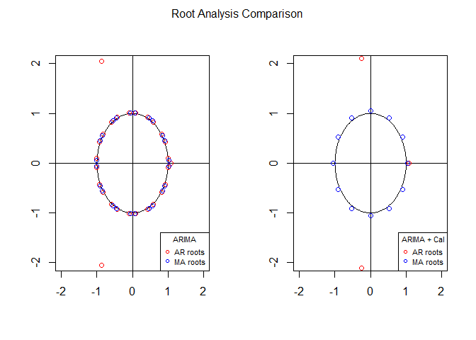
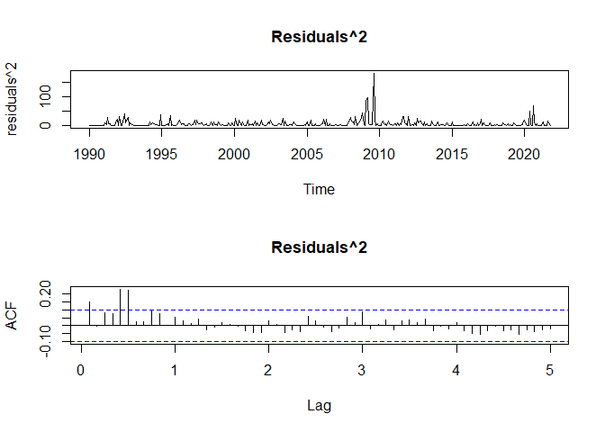
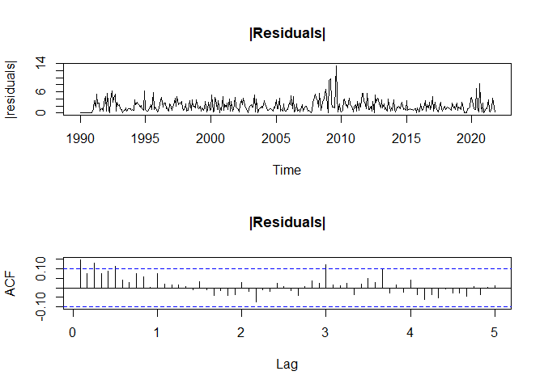
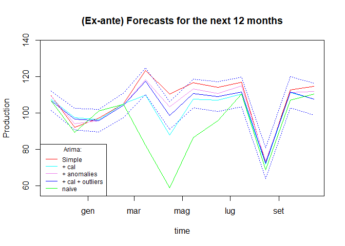

Economic Time Series Analysis
================
David Alexander Moe
2023

The analysis concerns the industrial production index (base 2015 = 100),
which measures the change over time in the physical volume (output) of
production carried out by industry. The monthly value is derived from a
special sample survey conducted among Italian industrial enterprises.
The time series runs from January 1990 to October 2021 (382
observations). The data can be found on the ‘Eurostat’ website:
<https://ec.europa.eu/eurostat/data/database>.

The objective of this analysis is to forecast the change in the
industrial production index for the next 12 months (short horizon), from
November 2021 to October 2022.

## Importing necessary dependencies

Importing libraries and functions that will be useful throughout the
analysis

``` r
rm(list = ls())

# libraries and functions
library(forecast)
```

    ## Registered S3 method overwritten by 'quantmod':
    ##   method            from
    ##   as.zoo.data.frame zoo

``` r
library(tseries)
library(tsoutliers)
library(urca)
library(FinTS)
```

    ## Caricamento del pacchetto richiesto: zoo

    ## 
    ## Caricamento pacchetto: 'zoo'

    ## I seguenti oggetti sono mascherati da 'package:base':
    ## 
    ##     as.Date, as.Date.numeric

    ## 
    ## Caricamento pacchetto: 'FinTS'

    ## Il seguente oggetto è mascherato da 'package:forecast':
    ## 
    ##     Acf

Look at the “Functions” folder to see all the specific details about the
functions.

``` r
source("G:/Il mio Drive/TRIENNALE/TS Analysis/Economic-TSA-ARIMA/Functions/TSA-Useful-Functions.R")
source("G:/Il mio Drive/TRIENNALE/TS Analysis/Economic-TSA-ARIMA/Functions/CalendarEffects-Functions.R")
source("G:/Il mio Drive/TRIENNALE/TS Analysis/Economic-TSA-ARIMA/Functions/TSA-Predict-Functions.R")
```

## Read data and declare some external variables

``` r
filedati <- "G:\\Il mio Drive\\TRIENNALE\\TS Analysis\\Economic-TSA-ARIMA\\Production in industry - monthly data (Italy).csv"

#### Read data
dati <- read.table(file = filedati, header = TRUE, sep = ",", quote = "", 
                   na.strings = ".", check.names = FALSE, comment.char = "")
name <- "Industrial production in Italy"

dati$TIME_PERIOD <- paste(dati$TIME_PERIOD,"-15",sep="")
dati$TIME_PERIOD <- gsub("-","",dati$TIME_PERIOD)
dati$TIME_PERIOD <- as.Date(x=dati$TIME_PERIOD, format= "%Y %m %d")

start <- as.numeric( c( format(dati$TIME_PERIOD[1], "%Y"), format(dati$TIME_PERIOD[1], "%m") ) )

y <- ts(data=dati$OBS_VALUE, start= start, frequency=12)
```

``` r
# some external variables

#### calendar effects
cal <- .calendarEffects(time = dati$TIME_PERIOD, country = "it")
```

    ## Caricamento del pacchetto richiesto: timeDate

    ## Caricamento del pacchetto richiesto: car

    ## Caricamento del pacchetto richiesto: carData

``` r
#cal <- cal[, c("Mon", "Tue", "Wed", "Thu", "Fri", "Sat","Sun","sh", "lh", "eh"), drop = FALSE]
cal <- cal[, c("wd", "lh", "eh"), drop = FALSE]

cal <- as.matrix(cal)

#### Drift if needed
drift <- cbind(drift = 1 : NROW(y))
```

## Preliminary analysis

``` r
#### Ts plot, acf, pacf of the original series
# par(mfrow = c(3,1))
x <- y
plot(x, type = "l", main = name, ylab = "Index Number",xlab="Time")
```

<!-- -->

The graph depicts the time series: there is a strong annual seasonality
and an upward trend until 2008, the year of the economic crisis.
Following this, the industrial production index maintained an almost
constant level until the Covid-19 period.

``` r
Acf(x = x, type = "correlation", na.action = na.pass, lag.max = 60, main = name)
```

<!-- -->

``` r
Acf(x = x, type = "partial",     na.action = na.pass, lag.max = 60, main = name)
```

<!-- -->

Given the monthly seasonality, a seasonal ARIMA model (p, d, q)x(P, D,
Q)\[S\] with period S=12 is used for the analysis. These graphs show the
ACF and PACF respectively, i.e. the autocorrelation and partial
autocorrelation at different lags which are indicated in years. The ACF
graph confirms the presence of seasonality, given the decay of ACF at
multiple lags of S, while the PACF graph denotes that $\psi(12)$ is
close to 1: it would appear that the stochastic process is
non-stationary due to the seasonal part (D\>0). To be sure of this
non-stationarity, the Augmented Dickey-Fuller (ADF) test is performed.

``` r
#### UNIT ROOT TESTS:
#### DF/ADF tests with trend
#### The following rows show how to make DF test in practice.
##   DF is however not recommended because gives severely biased results 
##   in case the DGP is more complex than the equation estimated by DF.
##   This time series prove this (compare DF with ADF results)
df.1 <- ur.df(y = y, type = "trend", lags = 0, selectlags = "Fixed") 
df.2 <- ur.df(y = y, type = "drift", lags = 0, selectlags = "Fixed") 
df.3 <- ur.df(y = y, type = "none",  lags = 0, selectlags = "Fixed")


#### (DGP:   RW + drift; 
##    Model: AR(1) + trend (+ other possible stationary terms))

adf.1 <- ur.df(y = y, type = "trend", lags = 24, selectlags = "AIC")
print( adf.1@teststat )
```

    ##                tau3     phi2     phi3
    ## statistic -1.762103 1.656208 2.408001

``` r
print( adf.1@cval )
```

    ##       1pct  5pct 10pct
    ## tau3 -3.98 -3.42 -3.13
    ## phi2  6.15  4.71  4.05
    ## phi3  8.34  6.30  5.36

``` r
##   1) H0(1) -> tau3 A and H0(2) -> phi3 A => no trend, go to 2   
##   2) H0(3) -> phi2 A                     => no drift, go to 3   

#### (DGP:   RW; 
##    Model: AR(1) + drift (+ other possible stationary terms))

adf.2 <- ur.df(y = y, type = "drift", lags = 24, selectlags = "AIC")
print( adf.2@teststat )
```

    ##                 tau2      phi1
    ## statistic -0.7810373 0.3805903

``` r
print( adf.2@cval )
```

    ##       1pct  5pct 10pct
    ## tau2 -3.44 -2.87 -2.57
    ## phi1  6.47  4.61  3.79

Accepting all tested H0s,
$$H0(1): \gamma=0, H0(2): \xi=\gamma=0, H0(3): \omega=\xi=\gamma=0, H0(5): \gamma=0 , H0(6): \omega=\gamma=0$$
(the last 2 H0s obtained by switching to DGP=RW and $\xi=0$ in the
model) we conclude that at least one unit root is definitely present.
From the data, it appears that the unit root found is due to the
seasonal part.

Therefore, a new ADF test on twelfths differences is carried out to
identify other possible URs:

``` r
dod <- diff(y,lag=12)
adf.3 <- ur.df(y = dod, type = "trend", lags = 24, selectlags = "AIC")
print( adf.3@teststat )
```

    ##               tau3     phi2     phi3
    ## statistic -4.53685 6.879441 10.30642

``` r
print( adf.3@cval )
```

    ##       1pct  5pct 10pct
    ## tau3 -3.98 -3.42 -3.13
    ## phi2  6.15  4.71  4.05
    ## phi3  8.34  6.30  5.36

From which we note that there are not other URs.

## ARIMA estimation

Based on the preliminary analyses, the starting point for modelling
ARIMA is the setting of d=0 and D=1, after which p, q, P and Q are
formulated. From here, after various considerations based on Information
Criteria, residual analysis, likelihood values and coefficient
estimation, it is concluded that the best model without external
regressors is:

``` r
#### ARIMA (no external regressors)
xreg <- NULL
fit <- Arima(y = y, 
             order = c(3, 0, 0), seasonal = list(order = c(2, 1, 2)),
             xreg = xreg, include.constant = FALSE)
print(summary(fit))
```

    ## Series: y 
    ## ARIMA(3,0,0)(2,1,2)[12] 
    ## 
    ## Coefficients:
    ##          ar1     ar2     ar3    sar1     sar2     sma1    sma2
    ##       0.5646  0.1237  0.1856  0.7893  -0.7183  -1.2769  0.6847
    ## s.e.  0.0546  0.0598  0.0531  0.0512   0.0593   0.0593  0.0518
    ## 
    ## sigma^2 = 23.43:  log likelihood = -1115.63
    ## AIC=2247.26   AICc=2247.65   BIC=2278.56
    ## 
    ## Training set error measures:
    ##                       ME     RMSE      MAE        MPE     MAPE      MASE
    ## Training set -0.06338866 4.718149 3.300577 -0.1162674 3.153389 0.6092663
    ##                     ACF1
    ## Training set 0.002636803

``` r
fit1 <- fit
```

By inserting external regressors, in particular calendar variables and
possible anomalies, the selected model is:

``` r
#### ARIMA + external regressors (var di calendario)
xreg <- cal
fit <- Arima(y = y,
             order = c(3, 0, 0), seasonal = list(order = c(0, 1, 1)),
             xreg = xreg, include.constant = FALSE)
print(summary(fit))
```

    ## Series: y 
    ## Regression with ARIMA(3,0,0)(0,1,1)[12] errors 
    ## 
    ## Coefficients:
    ##          ar1      ar2     ar3     sma1      wd      lh      eh
    ##       0.8104  -0.1207  0.2034  -0.5580  0.9470  1.7404  1.7385
    ## s.e.  0.0520   0.0675  0.0510   0.0425  0.0429  0.4125  0.2261
    ## 
    ## sigma^2 = 14.71:  log likelihood = -1021.56
    ## AIC=2059.12   AICc=2059.52   BIC=2090.43
    ## 
    ## Training set error measures:
    ##                       ME     RMSE      MAE         MPE     MAPE      MASE
    ## Training set -0.06562291 3.738451 2.422425 -0.07911977 2.369024 0.4471648
    ##                     ACF1
    ## Training set 0.004166258

``` r
fit2 <- fit
```

The inclusion of the variable ‘working days’ (wd) is motivated by the
fact that only Sundays and single holidays were not significant in the
model with all calendar variables.

``` r
#### Root analysis
#parte ar(p) con A(L)=0 e ma(q) con B(L)=0
par(mfrow = c(1,2))

#fit1
root <- .arma.roots(fit = fit1)
.circle(win = 2)
points(root$root$ar, col = "red")
points(root$root$ma, col = "blue")
legend("bottomright", inset= 0, title="ARIMA", 
       legend=c("AR roots", "MA roots"),
       col=c("red", "blue"), pch=1, cex=.70)

#fit2
root <- .arma.roots(fit = fit2)
.circle(win = 2)
points(root$root$ar, col = "red")
points(root$root$ma, col = "blue")
legend("bottomright", inset= 0, title="ARIMA + Cal", 
       legend=c("AR roots", "MA roots"),
       col=c("red", "blue"), pch=1, cex=.70)

mtext("Root Analysis Comparison", side = 3, line = -1.5, outer = TRUE)
```

<!-- -->

``` r
### fit1 shows MA roots (stemming from the seasonal part) critically close to 1
### in module.
### invertible MA part (roots B(L)B*(L^s)=0) -> here arima is invertible
### some ar roots very close to those ma -> lower Q from 2 to 1 in the model+cal and try again
### much better results by clearly having more separated roots
```

Using the powerful tso() function in the models specified so far yields
the anomalies. In these chunks of code is presented a portion of the
ARIMA modeling with some external regressors.

``` r
################################################################################
## ARIMA modeling with anomalies
################################################################################

#####################################
## ARIMA
#####################################

#### Copy model
fit <- fit1
#### Extract settings
settings <- .Arima.settings(fit = fit)
#### Prepare xreg
xreg <- NULL

#### Fit
fit <- tso(y = y, xreg = xreg,
           types = c("AO", "LS", "TC"), delta = 0.7, cval = 5,
           maxit = 10, maxit.iloop = 100, maxit.oloop = 10,
           tsmethod = "arima",
           args.tsmethod = list( order = settings$order, seasonal = settings$seasonal) )
fit1.o <- fit

#### Reporting
print(fit)
```

    ## 
    ## Call:
    ## list(method = NULL)
    ## 
    ## Coefficients:
    ##          ar1     ar2     ar3    sar1     sar2     sma1    sma2     LS228
    ##       0.2137  0.2486  0.3726  0.8482  -0.8565  -1.1612  0.7936  -14.7659
    ## s.e.  0.0510  0.0490  0.0525  0.0447   0.0735   0.0474  0.1045    2.2063
    ##          TC363     AO364
    ##       -34.0485  -22.0353
    ## s.e.    2.7729    3.0110
    ## 
    ## sigma^2 estimated as 12.66:  log likelihood = -1006.45,  aic = 2034.91
    ## 
    ## Outliers:
    ##   type ind    time coefhat   tstat
    ## 1   LS 228 2008:12  -14.77  -6.692
    ## 2   TC 363 2020:03  -34.05 -12.279
    ## 3   AO 364 2020:04  -22.04  -7.318

``` r
plot(fit)
```

<!-- -->

``` r
#### Extract outlier effects fro  the above model
oeff <- outliers.effects(mo = fit$outliers, n = NROW(y), pars = coef(fit$fit),
                         weights = FALSE)

## Plot weighted effects
par(mfrow=c(1,1))
plot(x = dati$TIME_PERIOD, main="Anomalies weighted effects", xlab="Year", ylab="effect", y = rowSums(oeff), type = "l")
```

<!-- -->

``` r
#### Estimate again
xreg <- as.matrix( oeff )
fit <- Arima(y = y,
             order = settings$order, seasonal = settings$seasonal,
             include.constant = settings$include.constant,
             xreg = xreg)
fit3 <- fit
```

``` r
#####################################
## ARIMA + calendar effects
#####################################

#### Copy model
fit <- fit2
#### Extract settings
settings <- .Arima.settings(fit = fit)
#### Prepare xreg
xreg <- cal
#xreg <- if ( settings$include.drift ) { cbind(drift, xreg) } else { xreg }
#### Fit
fit <- tso(y = y, xreg = xreg,
           types = c("AO", "LS", "TC"), delta = 0.7, cval = 5,
           maxit = 10, maxit.iloop = 100, maxit.oloop = 10,
           # tsmethod = "auto.arima",
           # args.tsmethod = list(allowdrift = false, ic = "bic", trace = true) )
           tsmethod = "arima",
           args.tsmethod = list( order = settings$order, seasonal = settings$seasonal) )
fit2.o <- fit

### Reporting
print(fit)
```

    ## 
    ## Call:
    ## list(method = NULL)
    ## 
    ## Coefficients:
    ##          ar1     ar2     ar3     sma1      wd      lh      eh     LS228
    ##       0.5058  0.1597  0.2329  -0.4220  0.9500  1.7838  1.7255  -13.1688
    ## s.e.  0.0528  0.0582  0.0519   0.0546  0.0364  0.3108  0.1873    2.0820
    ##          TC363     AO364
    ##       -34.7474  -21.8548
    ## s.e.    2.1791    2.0552
    ## 
    ## sigma^2 estimated as 6.974:  log likelihood = -885.97,  aic = 1793.94
    ## 
    ## Outliers:
    ##   type ind    time coefhat   tstat
    ## 1   LS 228 2008:12  -13.17  -6.325
    ## 2   TC 363 2020:03  -34.75 -15.945
    ## 3   AO 364 2020:04  -21.85 -10.634

``` r
plot(fit)
```

<!-- -->

``` r
### Extract elements
## Outlier effects
oeff <- outliers.effects(mo = fit$outliers, n = NROW(y), pars = coef(fit$fit),
                         weights = FALSE)
## Plot weighted effects
par(mfrow=c(1,1))
plot(x = dati$TIME_PERIOD, main="Anomalies weighted effects", xlab="Year", ylab="effect", y = rowSums(oeff), type = "l")
```

<!-- -->

The outliers graph shows the presence of 3 outliers: an LS from December
2008, and a TC and AO at the start of the Covid-19 pandemic (March-April
2020). The anomalies have a substantial impact since the ICs of the
simple ARIMA integrated with anomalies are much lower than the model
with calendar variables. As a result of these considerations, it can be
conjectured that the best model is the ARIMA integrated with calendar
variables and anomalies.

``` r
#### Estimate again
xreg <- cbind(cal, oeff)
fit <- Arima(y = y,
             order = settings$order, seasonal = settings$seasonal,
             include.constant = settings$include.constant,
             xreg = xreg)
fit4 <- fit

#### Root analysis dei modelli con anomalie
#parte ar(p) con A(L)=0 e ma(q) con B(L)=0
par(mfrow = c(1,2))

#fit3
root <- .arma.roots(fit = fit3)
.circle(win = 2)
points(root$root$ar, col = "red")
points(root$root$ma, col = "blue")
legend("bottomright", inset= 0, title="ARIMA + Outliers", 
       legend=c("AR roots", "MA roots"),
       col=c("red", "blue"), pch=1, cex=.70)

#fit4
root <- .arma.roots(fit = fit4)
.circle(win = 2)
points(root$root$ar, col = "red")
points(root$root$ma, col = "blue")
legend("bottomright", inset= 0, title="ARIMA + Calendar + Outliers", 
       legend=c("AR roots", "MA roots"),
       col=c("red", "blue"), pch=1, cex=.70)

mtext("Root Analysis Comparison", side = 3, line = -1.5, outer = TRUE)
```

<!-- -->

As expected, the model that best fits the data is the last one, which
has the same anomalies as the model without calendar variables. This
last graph shows the roots of the AR and MA characteristic equations. In
the first model, they are very close to each other: reshaping the ARMA
orders solves this problem.

## Diagnostics

``` r
fit <- fit4

#### Useful quantities
npar1  <- NROW(fit$coef)                            ## Number of parameters
lag1   <- npar1 + c(1, 2, 5, 10, 15, 20)
res1   <- residuals(fit)                            ## Residuals
resst1 <- ( res1 - mean(res1) ) / sqrt(fit$sigma2)  ## Standardized residuals

#### Ts plot, acf, pacf, Ljung-Box of residuals
par(mfrow = c(2,1), cex.main=1.15)
main <- "Residuals"
x1 <- res1
plot(x1, type = "l", main = main, ylab = "Residuals")
Acf(x = x1, type = "correlation", lag.max = 60, na.action = na.pass, main = main)
```

<!-- -->

``` r
# lb <- Box.test(x = res1, lag = 10, type = "Ljung-Box", fitdf = NROW(fit$coef))
cat("\n", paste("Ljung-Box of", main, "on different lags\n") )
```

    ## 
    ##  Ljung-Box of Residuals on different lags

``` r
lb <- mapply(FUN = Box.test, lag = lag1, 
             MoreArgs = list(x = x1, type = "Ljung-Box", fitdf = npar1))[1:3, , drop = FALSE]
print(rbind(lag1,lb))
```

    ##           [,1]         [,2]         [,3]        [,4]         [,5]        
    ## lag1      11           12           15          20           25          
    ## statistic 15.90651     17.43224     24.71936    30.9941      39.22983    
    ## parameter 1            2            5           10           15          
    ## p.value   6.654938e-05 0.0001639222 0.000157837 0.0005880431 0.0005920806
    ##           [,6]       
    ## lag1      30         
    ## statistic 44.97053   
    ## parameter 20         
    ## p.value   0.001113668

``` r
### The test is highly significant at all lags, although the ACF does not show much room for improvement 


#### Ts plot, acf of residuals^2
main <- "Residuals^2"
x1 <- res1^2
plot(x1, type = "l", main = main, ylab = "residuals^2")
Acf(x = x1, type = "correlation", lag.max = 60, na.action = na.pass, main = main)
```

<!-- -->

``` r
#### Ts plot, acf of |residuals|
main <- "|Residuals|"
x1 <- abs(res1)
plot(x1, type = "l", main = main, ylab = "|residuals|")
Acf(x = x1, type = "correlation", lag.max = 60, na.action = na.pass, main = main)
```

<!-- -->

These Graphs show the plot and ACF of the model residuals integrated
with calendar variables and anomalies. They show that they have a
behaviour compatible with a white noise. The ACF of the squared
residuals and \|residuals\|, leads to the assumption that they are
generated by independent random variables. The autocorrelations almost
all fall within the bands.

Let’s check the ARCH test on\|residuals\|:

``` r
#### Another diagnostic: the ARCH test
cat("\n-----------------------------------------------------------------
  ARCH based preliminary analyses\n")
```

    ## 
    ## -----------------------------------------------------------------
    ##   ARCH based preliminary analyses

``` r
cat("ARCH test on demeaned log-returns\n")
```

    ## ARCH test on demeaned log-returns

``` r
lag <- c(1, 2, 3, 6, 12, 24)
at <- mapply(FUN = ArchTest, lags = lag, 
             MoreArgs = list(x = x1 , demean = TRUE))
print(at[1:3,])
```

    ##           [,1]       [,2]      [,3]       [,4]         [,5]         [,6]       
    ## statistic 6.231912   6.62628   7.107674   52.16441     60.62085     61.81133   
    ## parameter 1          2         3          6            12           24         
    ## p.value   0.01254682 0.0364017 0.06854389 1.728112e-09 1.739086e-08 3.52958e-05

Rejecting the null hypothesis at almost all M chosen past values leads
to the conclusion that the conditional variance is not entirely stable,
indicating that perhaps a transformation of the data is necessary to
stabilise it.

Here, the transformation test which suggests not transforming the data:

``` r
trt <- .trsf.test(fit = fit4, msg = "Transformation check on 'fit4'\n")
```

    ## Caricamento del pacchetto richiesto: sandwich

    ## Transformation check on 'fit4'
    ##       estimate          se      H0      tstat     se(HC)   tstat(HC)
    ## 1 -0.008419042 0.005419369 fit = 0   -1.55351 0.00622601   -1.352237
    ## 2 -0.008419042 0.005419369 fit = 1 -186.07683 0.00622601 -161.968750
    ## 3 -0.008419042 0.005419369 fit = 2 -370.60016 0.00622601 -322.585263
    ##       se(HAC)  tstat(HAC)
    ## 1 0.005873673   -1.433352
    ## 2 0.005873673 -171.684578
    ## 3 0.005873673 -341.935804

``` r
#### unconditional distribution of the standardised residuals
## Plot
par(mfrow = c(1,2))
hist(x = resst1, breaks = 25, freq = FALSE, main = "Residuals", xlab = "")
x1 <- seq(from = min(resst1), to = max(resst1)+1, length.out = 100) 
lines(x = x1, y = dnorm(x = x1, mean = 0, sd = 1), col = "red")
qqnorm(y = resst1, main = "Normal Q-Q Plot",
       xlab = "Theoretical quantiles", ylab = "Sample quantiles",
       plot.it = TRUE)
abline(a = 0, b = 1, col = "red")
```

<!-- -->

``` r
## Test di normalità
print( shapiro.test(x = res1 ) )
```

    ## 
    ##  Shapiro-Wilk normality test
    ## 
    ## data:  res1
    ## W = 0.97978, p-value = 3.464e-05

Here the unconditional distribution of the standardised residuals: it
denotes a certain leptokurticity and thus the Gaussian distribution does
not fit the data well. Indeed, in the Shapiro-Wilk normality test, the
null hypothesis of normality of the residuals is rejected (W = 0.97978,
p-value = 3.464e-05).

## Forecast

### Ex-post forecasts: all made 1-step ahead

``` r
#### Settings
J  <- 12                                              ## How many ex-post forecast to compute
H  <- 1                                               ## Forecasting horizon
t1 <- .predict.t1(nobs = NROW(y), J = J, n.ahead = H) ## 1st obs in the ex-post period (needed below)


#### No external regressors
pred1.1 <- .predict(object = fit1, n.ahead = H, t = t1, y = y,
                    fixed.n.ahead = TRUE)


#### If we have external regressors
newxreg <- cal
pred2.1 <- .predict(object = fit2, n.ahead = H, t = t1, y = y, xreg = newxreg,
                    fixed.n.ahead = TRUE)

#### If we have outliers
newxreg <- .oeff.4.predict(object = fit1.o, n.ahead = 0)
pred3.1 <- .predict(object = fit3, n.ahead = H, t = t1, y = y, xreg = newxreg,
                    fixed.n.ahead = TRUE)

#### If we have external regressors and outliers
x2 <- .oeff.4.predict(object = fit2.o, n.ahead = 0)
newxreg <- as.matrix(cbind(cal, x2))
pred4.1 <- .predict(object = fit4, n.ahead = H, t = t1, y = y, xreg = newxreg,
                    fixed.n.ahead = TRUE)

#### Naive
predn.1 <- .predict.naive(fit = fit4, J = J, n.ahead = H)

#### Bands
x1 <- .pred.bands(pred = pred1.1, alpha = 0.05)
x2 <- .pred.bands(pred = pred2.1, alpha = 0.05)
x3 <- .pred.bands(pred = pred3.1, alpha = 0.05)
x4 <- .pred.bands(pred = pred4.1, alpha = 0.05)

#### Error Measures
em1.1  <- .ErrorMeasures(y = y, fit = x1$mean, naive = predn.1)
em2.1  <- .ErrorMeasures(y = y, fit = x2$mean, naive = predn.1)
em3.1  <- .ErrorMeasures(y = y, fit = x3$mean, naive = predn.1)
em4.1  <- .ErrorMeasures(y = y, fit = x4$mean, naive = predn.1)
emn.1  <- .ErrorMeasures(y = y, fit = predn.1, naive = predn.1)
## Print
ErrorMeas <- data.frame(
  model = c("Arima", "Arima + Calendar", "Arima + Outliers", "Arima + Calendar + Outliers", "Naive"),
  h = H,
  rbind( em1.1, em2.1, em3.1, em4.1, emn.1, deparse.level = 0 ) )
print( ErrorMeas )
```

    ##                         model h         ME       MAE      RMSE          MPE
    ## 1                       Arima 1  0.4964769  6.340439  8.641446  0.002607055
    ## 2            Arima + Calendar 1  0.5994155  4.418633  6.337434  0.003563261
    ## 3            Arima + Outliers 1 -0.9643262  2.491835  3.114028 -0.011569882
    ## 4 Arima + Calendar + Outliers 1 -0.3326777  1.613038  2.103306 -0.004854811
    ## 5                       Naive 1  9.7583333 11.741667 18.626258  0.088640013
    ##         MAPE      RMSPE     ScMAE    ScRMSE
    ## 1 0.05977650 0.07916127 0.5399948 0.4639389
    ## 2 0.04176668 0.05818444 0.3763208 0.3402419
    ## 3 0.02573551 0.03380419 0.2122215 0.1671848
    ## 4 0.01663946 0.02322503 0.1373772 0.1129215
    ## 5 0.10905923 0.17117424 1.0000000 1.0000000

The naive in the table is a benchmark model that we take as a reference
for comparisons: in the case of the data considered, the naive behaves
like a seasonal RW because the process has seasonal integration. The
model that has the greatest gain in forecasting is ARIMA with calendar
effects and outliers because, when comparing all specified models with
naive, it has the lowest scaled measurement errors.

This next Graph shows the ex-post forecasts. It turns out that the
integrated model with calendar variables and outliers is the best
because the true observations are all within the prediction bands of
this model.

``` r
#### Plot
ind  <- (NROW(y) - J + 1) : NROW(y)
ind1 <- 1 : NROW(ind)
par(mfrow = c(1,1))
ylim <- range(
  x1$lower[ind1], x1$upper[ind1], x2$lower[ind1], x2$upper[ind1],
  x3$lower[ind1], x3$upper[ind1], x4$lower[ind1], x4$upper[ind1] )
time <- dati$TIME_PERIOD[ind]
plot(x = time, y = y[ind], ylim = c(60,125),
     main = "(Ex-post) Past 12 months forecasts", xlab = "time", ylab = "Production")
lines(x = time, y = x1$mean[ind1],  col = "red")
lines(x = time, y = x2$mean[ind1],  col = "cyan")
lines(x = time, y = x3$mean[ind1],  col = "violet")
lines(x = time, y = x4$mean[ind1],  col = "blue")
lines(x = time, y = predn.1[ind1],  col = "green", lty = "solid")
lines(x = time, y = x4$lower[ind1], col = "blue", lty = "dotted")
lines(x = time, y = x4$upper[ind1], col = "blue", lty = "dotted")
legend("bottomleft", inset=0, title="Arima: ", 
       legend=c("Simple","+ cal", "+ anomalies", "+ cal + outliers", "naive"), 
       col=c("red","cyan", "violet", "blue" ,"green"), lty=1, cex=0.75)
```

<!-- -->

### Ex-ante forecasts

``` r
#######################################################
## Ex-ante (genuine) forecasts: from 1 to H steps ahead
#######################################################

#### Settings
H  <- 12      ## Maximum forecasting horizon
t1 <- NROW(y) ## Last obs in the info set (T)

#### Time generation
## Useful for extending calendar and for plotting
time1 <- .extend.time(x = dati$TIME_PERIOD, n.ahead = H, by = "month")

#### No external regressors
newxreg <- NULL
pred1 <- .predict(object = fit1, n.ahead = H, t = t1, y = y, xreg = newxreg,
                  fixed.n.ahead = FALSE)

#### with external regressors
x1 <- .calendarEffects(time = time1)[, colnames(cal), drop = FALSE]
#I make the external v ar that I need for the forecast
#time1 what is outside the forecast period
newxreg <- as.matrix(rbind(cal, x1))
pred2 <- .predict(object = fit2, n.ahead = H, t = t1, y = y, xreg = newxreg,
                  fixed.n.ahead = FALSE)

#### outliers
x2 <- .oeff.4.predict(object = fit1.o, n.ahead = H)
newxreg <- x2
pred3 <- .predict(object = fit3, n.ahead = H, t = t1, y = y, xreg = newxreg,
                  fixed.n.ahead = FALSE)

#### external regressors + outliers
x2 <- .oeff.4.predict(object = fit2.o, n.ahead = H)
newxreg <- as.matrix( cbind( rbind(cal, x1), x2) )
pred4 <- .predict(object = fit4, n.ahead = H, t = t1, y = y, xreg = newxreg,
                  fixed.n.ahead = FALSE)

#### Naive
predn <- .predict.naive(fit = fit4, J = H, n.ahead = H) 

#### Bande
x1 <- .pred.bands(pred = pred1, alpha = 0.05)
x2 <- .pred.bands(pred = pred2, alpha = 0.05)
x3 <- .pred.bands(pred = pred3, alpha = 0.05)
x4 <- .pred.bands(pred = pred4, alpha = 0.05)


print( cbind(t = x1$t, pred1 = x1$mean, pred2 = x2$mean, pred3 = x3$mean, pred4 = x4$mean, 
             naive = predn) )
```

    ##         t     pred1     pred2     pred3     pred4 naive
    ##  [1,] 383 109.63928 107.68511 109.37147 106.80716 106.7
    ##  [2,] 384  92.04916  97.59451  94.11877  96.66864  89.2
    ##  [3,] 385  97.24372  96.45902  95.71283  95.74120 101.2
    ##  [4,] 386 104.98982 105.18031 104.16929 104.27615 104.9
    ##  [5,] 387 123.54449 109.82570 118.21425 117.46226  82.2
    ##  [6,] 388 110.35501  87.76755 103.28255  98.54278  58.8
    ##  [7,] 389 116.62642 107.65041 113.21813 110.77214  86.5
    ##  [8,] 390 114.02858 106.93572 110.74957 109.04532  95.9
    ##  [9,] 391 117.02277 110.50236 115.00710 111.61209 110.5
    ## [10,] 392  72.75421  71.65041  73.50387  72.33411  68.8
    ## [11,] 393 112.56803 111.16014 111.28157 111.53717 107.2
    ## [12,] 394 114.80017 107.52831 111.88744 107.61576 110.5

``` r
#### Plot
par(mfrow = c(1,1))
ylim <- range(
  x1$lower, x1$upper, x2$lower, x2$upper,
  x3$lower, x3$upper, x4$lower, x4$upper, predn )
time <- time1
plot(x = time, y = x1$mean, type = "l", col = "red",
     main = "(Ex-ante) Forecasts for the next 12 months", xlab = "time", ylab = "Production",
     ylim = ylim)
lines(x = time, y = x2$mean,  col = "cyan")
lines(x = time, y = x3$mean,  col = "violet")
lines(x = time, y = x4$mean,  col = "blue")
lines(x = time, y = x4$lower, col = "blue", lty = "dotted")
lines(x = time, y = x4$upper, col = "blue", lty = "dotted")
lines(x = time, y = predn, col = "green")
legend("bottomleft", inset=0, title="Arima: ", 
       legend=c("Simple","+ cal", "+ anomalies", "+ cal + outliers", "naive"), 
       col=c("red","cyan", "violet", "blue" ,"green"), lty=1, cex=0.75)
```

<!-- -->

The ex-ante forecasts follow similar trends. In particular, a negative
peak in production is observed around August 2022, which is likely to
occur.
